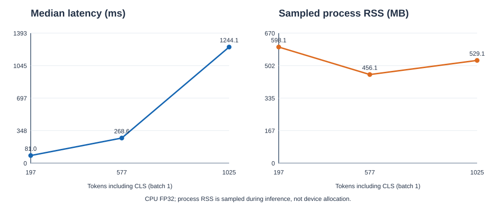
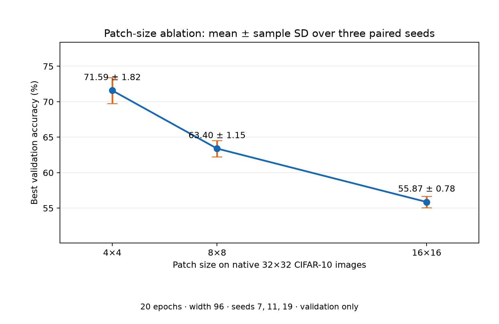
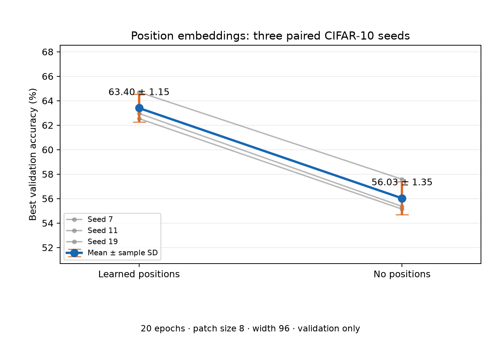
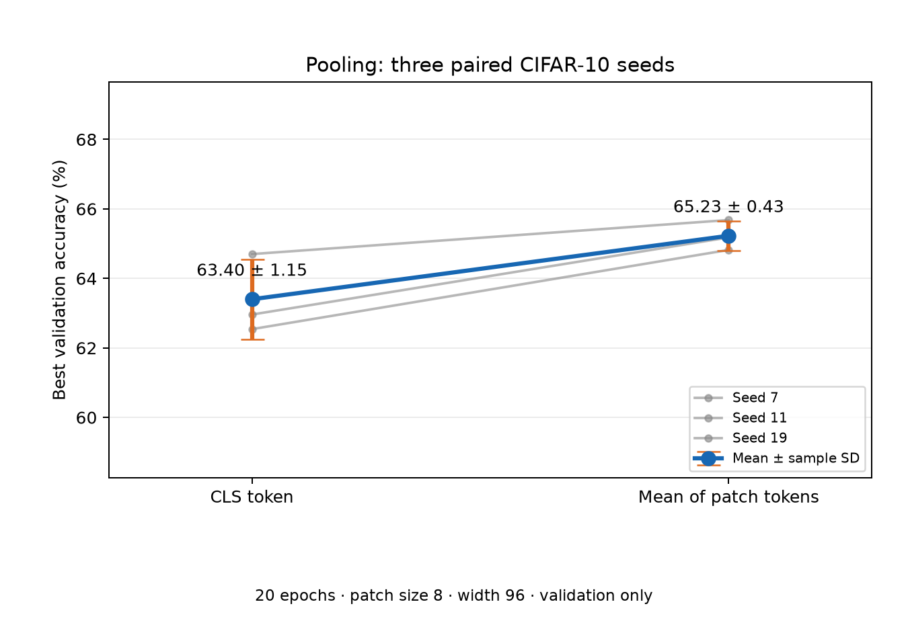
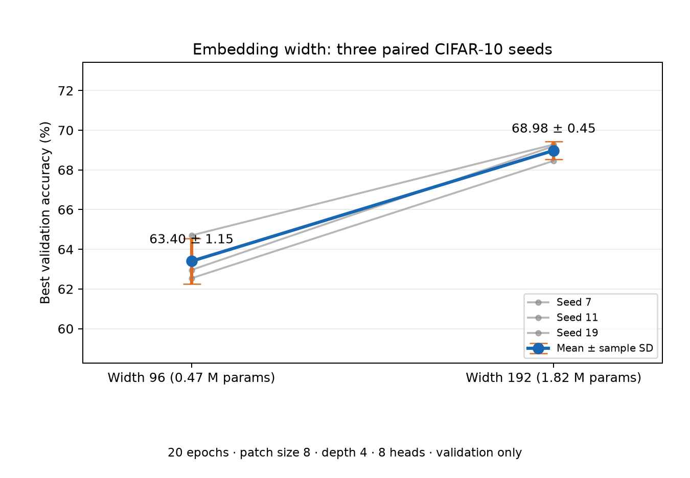
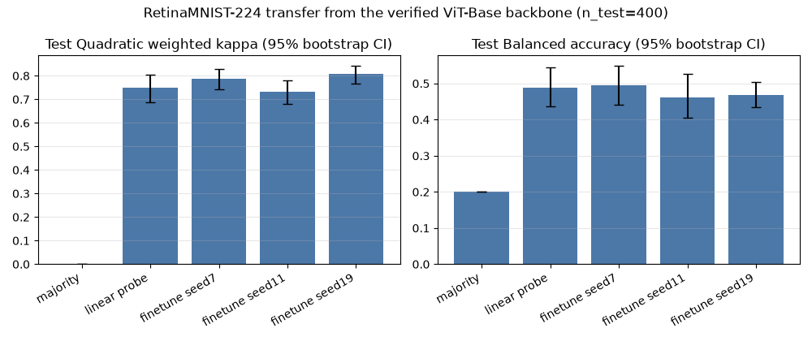

# Inside the Vision Transformer

A from-scratch PyTorch Vision Transformer, verified layer by layer against a pinned pretrained reference, then used for attention diagnostics, cost benchmarks, five controlled CIFAR-10 ablations, and a retinal transfer study.

**Claim.** The educational model in `src/vit_lab/models/` (explicit patch projection, packed QKV, manual `softmax(QKᵀ/√d)V`, pre-norm blocks) loads all 152 tensors of `timm/vit_base_patch16_224.augreg_in21k_ft_in1k` at revision `b5b38b8` (SHA-256 `c401d219…9800`) with `strict=True`, and reproduces every captured intermediate stage and the logits on CPU/FP32. Every number below comes from a saved run with its config, seed, split, and environment. No CIFAR-10 test-set accuracy is reported; the test split was never used.

- Scope and phases: [execution plan](VIT_EXECUTION_PLAN.md), [original brief](PROJECT_SPEC.md), [handoff status](PROJECT_STATUS.md)
- Reports: [architecture](docs/architecture.md), [mathematics](docs/mathematics.md), [reference contract](docs/reference_contract.md), [reverse engineering](docs/reverse_engineering.md), [attention analysis](docs/attention_analysis.md), [benchmarking](docs/benchmarking.md), [experiments](docs/experiments.md)

## Setup

Python 3.12. `requirements-lock.txt` is the tested resolution (macOS arm64, PyTorch 2.14.1, timm 1.0.30).

```bash
python3.12 -m venv .venv
source .venv/bin/activate
python -m pip install --upgrade pip
python -m pip install -e '.[dev,experiments]'
pytest -q
```

## Reproduce

```bash
vit-lab inspect-reference --config configs/vit_base.yaml                 # downloads and hash-checks the checkpoint
python -c "from torchvision.datasets import CIFAR10; CIFAR10('data', train=True, download=True)[0][0].save('data/cifar_train_00000.png')"
vit-lab compare --config configs/vit_base.yaml --offline --device cpu --image data/cifar_train_00000.png   # 4 inputs x 25 stages
vit-lab train --config configs/vit_tiny_cifar.yaml --run-dir results/runs/cifar_tiny_seed7 --device cpu
vit-lab analyze --config configs/vit_base.yaml --device cpu --offline    # attention and representation diagnostics
vit-lab benchmark --config configs/vit_base.yaml --offline --threads 4 --warmups 2 --trials 5
python scripts/run_patch_ablation.py --run      # likewise run_head_, run_position_, run_pooling_, run_width_ablation.py
python scripts/run_retina_transfer.py --offline
```

Ablation runners resume interrupted cases and refuse configs that differ from the frozen ones. Exact plot and cost commands for each study are in [experiments.md](docs/experiments.md).

## Reference equivalence

Four fixed inputs (seeded random, zeros, a generated RGB image, and a real CIFAR-10 image through the reference preprocessing), 25 captured stages each, reference fused attention disabled. Details: [reverse_engineering.md](docs/reverse_engineering.md), [equivalence.csv](results/tables/equivalence.csv), [weight_mapping.csv](results/tables/weight_mapping.csv).

| Measure | Result |
|---|---:|
| State-dict keys and shapes mapped | 152 / 152 |
| Stage comparisons meeting `rtol=1e-4, atol=1e-5` | 100 / 100 |
| Largest absolute difference | 0.0 |

## Diagnostics and cost

Selected CLS-to-patch attention maps (layers 1/6/12) and CLS representation drift on four fixed images are in [attention_analysis.md](docs/attention_analysis.md). They are attention diagnostics, not explanations or localization.

CPU FP32 inference on Apple M1, 86,567,656 parameters ([benchmarking.md](docs/benchmarking.md)):

| Model | Input | Tokens | Median batch-1 latency |
|---|---:|---:|---:|
| Educational, manual attention | 224 px | 197 | 81.0 ms |
| Educational, manual attention | 384 px | 577 | 268.6 ms |
| Educational, manual attention | 512 px | 1,025 | 1,244.1 ms |
| timm, fused attention | 224 px | 197 | 75.9 ms |



## CIFAR-10 controlled ablations

Native 32×32 CIFAR-10, trained from scratch for 20 epochs, depth 4, best-validation checkpoint on a fixed stratified 45,000/5,000 split of the official training set. Three paired seeds (7/11/19) per variant share the split and all training controls; only the named factor changes. Values are best validation accuracy, mean ± sample SD. The original baseline (P=4, width 96, seed 7, 69.50%) is the P=4 seed-7 case of the patch-size study.

| Factor (fixed: P=8, width 96, 8 heads, CLS, learned positions) | Variants | Validation accuracy |
|---|---|---|
| Patch size | P=4 / 8 / 16 | **71.59 ± 1.82** / 63.40 ± 1.15 / 55.87 ± 0.78 |
| Attention heads | 4 / 8 / 12 / 16 | 63.76 ± 0.84 / 63.40 ± 1.15 / 62.96 ± 0.58 / 62.87 ± 0.82 |
| Position embedding | learned / none | **63.40 ± 1.15** / 56.03 ± 1.35 |
| Pooling | CLS / mean of patches | 63.40 ± 1.15 / **65.23 ± 0.43** |
| Embedding width | 96 / 192 | 63.40 ± 1.15 / **68.98 ± 0.45** |

Smaller patches, learned positions, mean pooling, and width 192 each beat their alternative in all three paired seeds. Head count made no clear difference at fixed width. Three seeds give descriptive spread, not confidence intervals; other budgets and datasets could change these rankings. Per-seed values, measured cost, and limits: [experiments.md](docs/experiments.md).






## RetinaMNIST transfer

Five-grade diabetic-retinopathy grading on MedMNIST RetinaMNIST-224 (official 1,080/120/400 splits, CC BY 4.0), starting from the verified backbone. Model selection used validation QWK only; the test set was evaluated once per selected model. CPU limits meant a partial fine-tune (blocks 11–12, final norm, new head). 95% bootstrap intervals over test images.

| Method (test, n=400) | Balanced accuracy | Macro-F1 | QWK [95% CI] |
|---|---:|---:|---:|
| Majority class | 20.0% | 0.121 | 0.000 |
| Frozen-feature linear probe | 48.8% | 0.501 | 0.750 [0.688, 0.804] |
| Partial fine-tune, 3 seeds (mean ± SD) | 47.6 ± 1.7% | 0.428 ± 0.043 | 0.775 ± 0.038 |

The pretrained features transfer well above the majority baseline. Partial fine-tuning showed no reliable gain over the linear probe: it overfit within one or two epochs, and seed variation exceeds the gap. Research and education only, not a clinical claim. Details: [experiments.md](docs/experiments.md#retinamnist-transfer-study).



## Limitations

- Verified device is CPU only. MPS was unavailable on this host and CUDA was not tested; benchmark timings vary with host load, and process RSS is not device peak memory.
- CIFAR-10 models are small and trained for a fixed 20-epoch budget; width-192 was still improving at epoch 19–20.
- The CIFAR images in the equivalence and attention checks are 32×32 photographs resized to 224×224. They test numerics, not native high-resolution detail.
- The transfer study uses partial, not full, fine-tuning, a 120-image validation set, and no augmentation.
- Datasets and checkpoints are excluded from Git; the code re-downloads them from the pinned sources.
