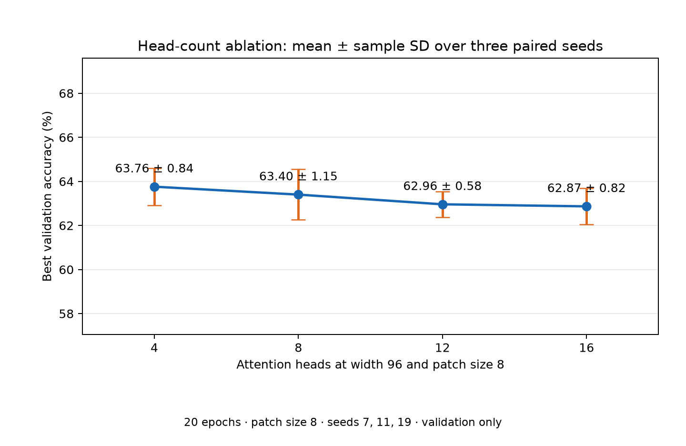

# Inside the Vision Transformer

A from-scratch Vision Transformer and reverse-engineering study focused on tensor flow, numerical equivalence, attention diagnostics, and computational cost.

This repository is in active development. The [execution plan](VIT_EXECUTION_PLAN.md) defines the phases and evidence required before results are reported. The [project specification](PROJECT_SPEC.md) preserves the original brief. The pinned reference checkpoint has been inspected and verified; see the [reference contract](docs/reference_contract.md).

## Setup

Use Python 3.12. On macOS:

```bash
python3.12 -m venv .venv
source .venv/bin/activate
python -m pip install --upgrade pip
python -m pip install -e '.[dev]'
```

The reference inventory command downloads the pinned checkpoint into the Hugging Face cache. It verifies its SHA-256 before loading it.

```bash
vit-lab inspect-reference --config configs/vit_base.yaml
vit-lab compare --config configs/vit_base.yaml --offline --device cpu
```

Run tests with `pytest -q`. The [reverse-engineering report](docs/reverse_engineering.md) records the verified CPU/FP32 layer comparison and links its [results](results/tables/equivalence.csv). The [experiment log](docs/experiments.md) records a completed 20-epoch CIFAR-10 CPU baseline: **69.50% validation accuracy** at seed 7, with identical validation predictions after reloading the best checkpoint. The official test split was not used. A fresh training run can be started or an interrupted one resumed with:

```bash
vit-lab train --config configs/vit_tiny_cifar.yaml --run-dir results/runs/cifar_tiny_seed7 --device cpu
vit-lab train --config configs/vit_tiny_cifar.yaml --run-dir results/runs/cifar_tiny_seed7 --device cpu --resume
```

Use the second command only if the first was interrupted after a completed epoch. The [attention analysis](docs/attention_analysis.md) records selected CLS attention maps and representation drift from four fixed real images. Once the official CIFAR-10 training files are in `data/`, reproduce it with:

```bash
vit-lab analyze --config configs/vit_base.yaml --device cpu --offline
```

The [benchmark report](docs/benchmarking.md) records a six-case CPU run with measured latency, sampled process memory, and analytical MACs. Its timing variation is documented.

## Controlled patch-size result

Nine full 20-epoch runs compared native 32×32 CIFAR-10 patch sizes 4, 8, and 16 with width 96 and paired seeds 7, 11, and 19. Best validation accuracy was **71.59 ± 1.82%**, **63.40 ± 1.15%**, and **55.87 ± 0.78%** respectively (mean ± sample SD). Every run's best checkpoint reproduced its saved validation predictions after reload. The [full experiment log](docs/experiments.md) includes per-seed values, compute costs, and limits. The official test split was not used.


## Controlled head-count result

Twelve 20-epoch cases compared 4, 8, 12, and 16 attention heads at fixed width 96 and patch size 8, with three paired seeds. Mean best validation accuracy was **63.76 ± 0.84%**, **63.40 ± 1.15%**, **62.96 ± 0.58%**, and **62.87 ± 0.82%** respectively (mean ± sample SD). The observed differences are small; the [experiment log](docs/experiments.md) includes every seed, measured CPU cost, and interpretation limits. The official test split was not used.



## Controlled position result

Three paired seeds compared learned absolute positions with no position vectors at fixed width 96, patch size 8, and eight heads. Best validation accuracy was **63.40 ± 1.15%** with learned positions and **56.03 ± 1.35%** without them (mean ± sample SD). The learned model led in all three paired seeds. The [experiment log](docs/experiments.md) includes the training curves, CPU costs, and a patch-permutation diagnostic. The official test split was not used.


The current [handoff status](PROJECT_STATUS.md) names the next single task and exact resume steps. Pooling, larger-width, and retinal-transfer studies remain pending.
